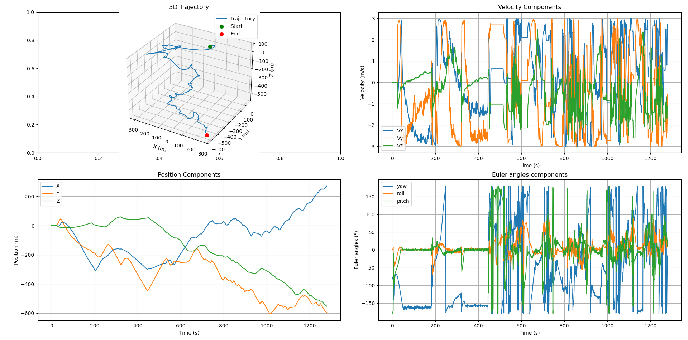

# IMU2Track_v3

**IMU2Track_v3.py** is a Python script for processing raw IMU (Inertial Measurement Unit) data to estimate orientation, velocity, and position.  
It applies bias correction, sensor fusion (Madgwick filter), motion constraints, and numerical integration to reconstruct motion trajectories.

The code is structured around five main classes plus one utility function.

---

## Quickstart

1. Place your IMU data in an Excel file (`.xlsx`) with columns for accelerometer, gyroscope, and optionally magnetometer + timestamp.  
2. Edit the bottom of **IMU2Track_v3.py** to point to your file:  
   ```python
   results = process_imu_data("your_file.xlsx", config)
3. First time running: run this command to install necessary libraries:
```bash
pip install -r requirements.txt
```
This will install all libraries from the `requirements.txt` file.
4. Run the script
  ```bash
  python IMU2Track_v3.py
  ```
5. View 3D trajectory, orientation, velocity, and acceleration plots.

## Usage

### 1. Prepare your data file
- Script expects `.xlsx` format with columns:

- acc_x(m/s²), acc_y(m/s²), acc_z(m/s²)
- ω_x(rad/s), ω_y(rad/s), ω_z(rad/s)
- mag_x(µT), mag_y(µT), mag_z(µT)
- timestamp(s) (optional)

### 2. Place your file
- Put your `.xlsx` file in the same folder as the script (or provide full path).

### 3. Edit the script
At the bottom of **IMU2Track_v3.py**, replace:
```python
results = process_imu_data('your_file.xlsx', config)
```
with your file name.

### 4. Run the script
```bash
python IMU2Track_v3.py
```
### 5. View results

Script will:

1. Process IMU data
2. Plot 3D trajectory, velocity, position, orientation
3. Output processed DataFrame

## Classes Overview

### 1. `IMUConfig`
Centralizes constants and parameters for computing orientation, velocity, and position.  
Key tunable parameters:

- **sample_rate [Hz]**: IMU sampling frequency.  
- **bias_estimation_window [samples]**: Samples used to estimate initial sensor bias.  
- **madgwick_beta**: Gain controlling filter correction (high = faster response, more noise).  
- **acc_lpf_cutoff [Hz]**: Low-pass cutoff for accelerometer.  
- **gyro_hpf_cutoff [Hz]**: High-pass cutoff for gyroscope.  
- **gravity_magnitude [m/s²]**: Expected gravity (≈9.81).  
- **gravity_alignment_samples [samples]**: Used for initial orientation.  
- **max_velocity [m/s]**: Maximum plausible velocity.  
- **max_acceleration [m/s²]**: Maximum plausible acceleration.  
- **outlier_threshold**: Std-dev limit for outlier rejection.  
- **smoothing_window [samples]**: Temporal smoothing length.  

---

### 2. `BiasEstimator`
Estimates and removes systematic IMU sensor biases.

- **`initialize_bias`**: Computes average gyroscope and accelerometer offsets from stationary samples.  
- **`correct_measurements`**: Subtracts biases from raw data.  

---

### 3. `MadgwickFilter`
Implements the [Madgwick AHRS filter](https://ahrs.readthedocs.io/en/latest/filters/madgwick.html) for orientation estimation.

- **Quaternion operations**:  
  - ` _quaternion_product(a, b)`  
  - ` _quaternion_conjugate(q)`  
- **`update`**: Full IMU + magnetometer orientation update.  
- **`update_imu_only`**: Uses only accelerometer + gyroscope (no magnetometer).  

---

### 4. `MotionConstraints`
Applies physical constraints to reduce drift.

- **`constrain_velocity`**: Limits velocity magnitude to `max_velocity`.  
- **`detect_outliers`**: Flags accelerations above `max_acceleration`.  

---

### 5. `IMUTracker`
Core class that runs the pipeline.

- **Initialization**:  
  - Loads `IMUConfig`.  
  - Applies `BiasEstimator`.  
  - Runs `MadgwickFilter`.  
  - Uses `MotionConstraints`.  
  - Sets initial state (pos/vel/acc/orientation).  
- **`initialize`**: Aligns gravity vector to world frame.  
- **`process_sample`**:  
  - Bias correction  
  - Orientation update  
  - Frame transformation  
  - Gravity compensation  
  - Outlier detection  
  - Velocity + position integration  
  - State logging  
- **`process_data`**: Runs `process_sample` over a dataset, outputs `pandas.DataFrame`.  
- **`plot_results`**: 3D trajectory and time-series plots.  

---

## Function

### `process_imu_data`
Reads IMU data from Excel, runs the `IMUTracker` pipeline, and returns processed results.

Steps:
1. Load `IMUConfig`.  
2. Read Excel file with `pandas`.  
3. Validate required columns.  
4. Clean missing values.  
5. Generate time vector.  
6. Process with `IMUTracker.process_data`.  
7. Plot + return results.  

---

## Output

### Plots:

- 3D trajectory
- Time series of position, velocity, acceleration
- Euler angles (roll, pitch, yaw)

Here is an example of the expected output.
<p align="center">
    </p>

### DataFrame:

- Position (x, y, z)
- Velocity (vx, vy, vz)
- Acceleration (ax, ay, az)
- Quaternion (qw, qx, qy, qz)
- Euler angles (roll, pitch, yaw)

You can find an example output dataframa at `output/output_example.xlsx`.

## Debug

1. If you have any missing library or outdated, use the following command inside a terminal to install and update the missing libraries:
```bash
pip install --upgrade -r requirements.txt
```

2. If the script does not find any data when loading your file (value error 'Missing required columns'), it is likely because the column names in your file do not match the expected ones. To fix this, you can either update the column names directly in your data file or adjust them in the script where the data is loaded.

3. If you notice significant drift in your results, this is not due to an error in the script. Instead, you will need to tune the filter parameters to better suit your data. If you are unsure how to do this, please refer to the technical review for guidance.

## Requirements

- Python 3.12 (other versions not tested)
- numpy, pandas, scipy, matplotlib

## TODO and notes

- Bias estimation (accelerometer and gyroscope) is done twice, once directly onboard the GSAT and a second time in this script. This should not bring major issues but still has to be addressed. Either remove bias calibration in the GSAT or in this script.
- Bias estimation and gravity alignment needs a completely stationnary GSAT to get the best results. In the next tests, place the GSAT on the ground for 30 seconds before going.
- There is a lot of drift on the Z-axis, this is inevitable with most IMUs as drift in Z grows quadratically with time, even with good calibration.
- Still not totally confident about the magnetometer alignment with North, to be checked again.
- Might be a problem in initial calibration with how samples are counted. I think that the bias_estimation_window number does not match the number of samples used for actual calibration.
- The Madgwick filter actually performs best using IMU-only data, which may be surprising since one might expect a full MARG setup to be superior. Tests show that the IMU-only approach provides higher precision under low-dynamic conditions, though this may not hold true during high-dynamic movements. MARG is also necessary to align Z-axis with North.
- Examining the reconstructed trajectory, the filter appears to struggle with accurately determining the direction of motion. This may be due to residual drift from the gyroscope integration. A solution is to reduce the $\beta$ value, giving more trust to raw measurements.
- X-axis is assumed to be pointing North when initialized. An "auto" mode will have to be implemented, to align IMU axes regardless of any axis pointing to North. This requires good calibration of magnetometer data to provide a good North angle estimation.